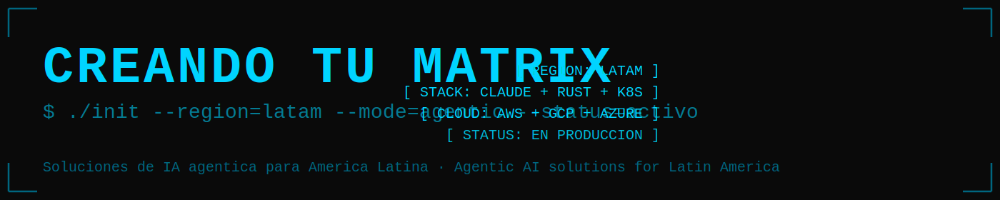

# CreandoTuMatrix Labs

**Soluciones de IA agéntica para América Latina.**  
Agentic AI solutions for Latin America.

---

Construimos sistemas de IA autónomos, infraestructura cloud-native y automatización inteligente para empresas en LATAM.

We build autonomous AI systems, cloud-native infrastructure, and intelligent automation for companies across Latin America.

---

## ¿Qué hacemos? / What We Do

- **Ingeniería agéntica** — Diseño e implementación de sistemas multi-agente con Claude Code y SPARC  
- **Infraestructura cloud** — AWS · GCP · Azure · Kubernetes · Terraform · GitOps  
- **Automatización DevSecOps** — CI/CD, secret scanning, compliance, observabilidad  
- **Coaching técnico** — Equipos de ingeniería que adoptan IA en su flujo de trabajo

---

## Proyectos / Projects

| Proyecto | Descripción |
|---|---|
| [turboflow-espanol](https://github.com/creandotumatrix-labs/turboflow-espanol) | Turbo-Flow en español — entorno de desarrollo agéntico avanzado para la comunidad hispanohablante |
| [turbo-flow-espanol-promotion](https://github.com/creandotumatrix-labs/turbo-flow-espanol-promotion) | Landing page de promoción de Turbo-Flow Español — materiales de marketing para la plataforma |
| [Casa_Lingua](https://github.com/creandotumatrix-labs/Casa_Lingua) | CasaLingua 2.0 — Centro de comando IA para profesionales inmobiliarios mexicanos. Due diligence, generación de documentos y calculadora fiscal |
| [tu-guia-ia](https://github.com/creandotumatrix-labs/tu-guia-ia) | Tu Guía IA — Plataforma educativa de IA en español con tutoriales y recursos para usuarios hispanohablantes |
| [guia-ai-gratis](https://github.com/creandotumatrix-labs/guia-ai-gratis) | Guía Completa de Ingeniería Agéntica — descarga gratuita para desarrolladores de habla hispana |

---

## Filosofía / Philosophy

> "Un solo ingeniero puede operar como un equipo completo."  
> "One engineer can operate like an entire team."

Nuestra metodología combina arquitectura de sistemas robusta con la velocidad que dan los agentes de IA modernos.

Our methodology combines robust systems architecture with the velocity that modern AI agents enable.

---

## Tecnología / Stack

Claude Code · Turbo-Flow · Rust · Python · Shell  
Kubernetes · Terraform · ArgoCD · AWS · GCP · Azure

---

## Contacto / Contact

🌐 [creandotumatrix.com](https://creandotumatrix.com)  
✉️ Ingeniería agéntica para LATAM — contáctanos para proyectos y colaboraciones

---

Built by [Marcus Patman](https://github.com/marcuspat) — Principal Agentic Engineer  
Open-source tooling at [adventurewave-labs](https://github.com/adventurewave-labs) · LATAM AI at [creandotumatrix-labs](https://github.com/creandotumatrix-labs)
