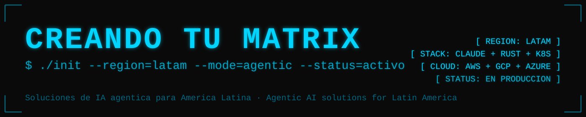

# CreandoTuMatrix Labs

**Soluciones de IA agéntica para América Latina.**  
Agentic AI solutions for Latin America.

---

Construimos sistemas de IA autónomos, infraestructura cloud-native y automatización inteligente para empresas en LATAM.

---

## ¿Qué hacemos? / What We Do

- **Ingeniería agéntica** — Diseño e implementación de sistemas multi-agente con Claude Code y SPARC  
- **Infraestructura cloud** — AWS · GCP · Azure · Kubernetes · Terraform · GitOps  
- **Automatización DevSecOps** — CI/CD, secret scanning, compliance, observabilidad  
- **Coaching técnico** — Equipos de ingeniería que adoptan IA en su flujo de trabajo

---

### El stack Turbo-Flow

| Herramienta | Estrellas | Lenguaje | Propósito |
|---|---|---|---|
| [**turbo-flow**](https://github.com/marcuspat/turbo-flow) | ⭐ 168 | Shell / Python | Entorno agéntico de desarrollo completo — 215+ herramientas MCP, memoria entre sesiones (Beads), grafo de conocimiento del código (GitNexus), aislamiento por agente con git worktrees. Un solo comando lo despliega en DevPod, Codespaces o Rackspace Spot. |
| [**turbo-flow-wizard**](https://github.com/adventurewave-labs/turbo-flow-wizard) | ⭐ 5 | Shell | Asistente de configuración guiada para turbo-flow — generador interactivo de archivos `CLAUDE.md` específicos por proyecto. 12 tipos de aplicación, 7 metodologías, 19 conjuntos de funcionalidades. |

## Proyectos / Projects

### Agentes comerciales de WhatsApp / WhatsApp business agents

Productos en despliegue con clientes — repositorios privados.  
*Commercial products in client deployment — private repositories.*

| Producto | Propósito |
|---|---|
| **asistente-pedidos** | Agente de pedidos y reservaciones por WhatsApp, marca blanca (es-MX), sobre un runtime compartido de tool-use con Claude. |
| **asistente-de-tienda** | Agente de soporte y ventas para retail y ecommerce por WhatsApp (es-MX), asentado sobre un catálogo real. |
| **asistente-comercial** | Calificador de prospectos por WhatsApp, agnóstico al vertical: califica → puntúa → agenda → enruta. |
| **cdmx-agent-demo** | MVP de agente marca blanca para PyMEs de CDMX — calificación de prospectos inmobiliarios y pedidos de restaurante sobre un mismo runtime. |
| **loyalty-club-engine** | Club de lealtad multi-comercio por WhatsApp — agente Claude + herramientas determinísticas + Postgres. |

---

## Filosofía / Philosophy

> "Un solo ingeniero puede operar como un equipo completo."  
> "One engineer can operate like an entire team."

Nuestra metodología combina arquitectura de sistemas robusta con la velocidad que dan los agentes de IA modernos.

Our methodology combines robust systems architecture with the velocity that modern AI agents enable.

---

## Tecnología / Stack

Claude Code · Turbo-Flow · Rust · Python · Shell  
Kubernetes · Terraform · ArgoCD · AWS · GCP · Azure

---

## Contacto / Contact

🌐 [creandotumatrix.com](https://creandotumatrix.com)  
✉️ Ingeniería agéntica para LATAM — contáctanos para proyectos y colaboraciones

---

Built by [Marcus Patman](https://github.com/marcuspat) — Principal Agentic Engineer  
Open-source tooling at [adventurewave-labs](https://github.com/adventurewave-labs) · LATAM AI at [creandotumatrix-labs](https://github.com/creandotumatrix-labs)
